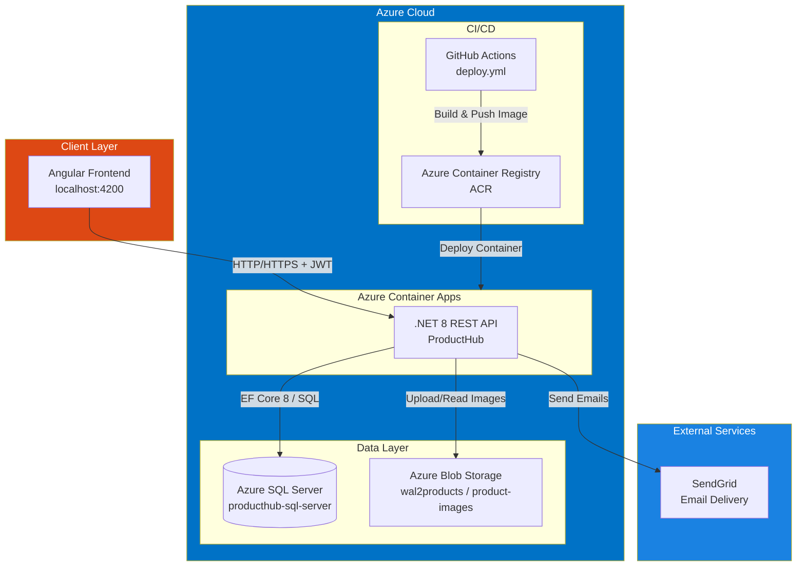
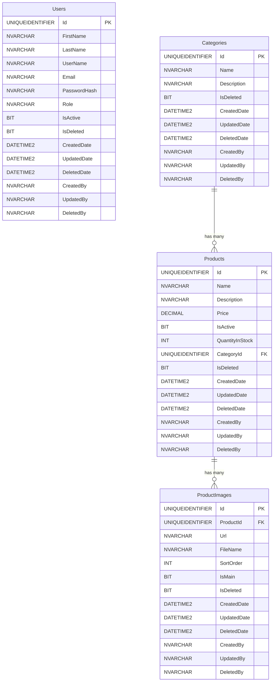

# ProductHub API

[](https://github.com/Arielhenriquez/ProductHub)
[](https://github.com/Arielhenriquez/ProductHub-Frontend/tree/init-ecommerce)
[](https://lemon-ground-02ebc910f.6.azurestaticapps.net)

Backend REST API for the ProductHub platform — a product management system with user authentication, category management, image storage, and email notifications.

Built with **.NET 8**, deployed on **Azure Container Apps**, backed by **Azure SQL Server**, with image storage on **Azure Blob Storage** and email delivery via **SendGrid**.

---

## Live Resources

| Resource | URL |
|----------|-----|
| Frontend (Angular) | [https://lemon-ground-02ebc910f.6.azurestaticapps.net](https://lemon-ground-02ebc910f.6.azurestaticapps.net) |
| Swagger UI (Production) | [https://producthub-api.wittysea-8d0d5478.eastus.azurecontainerapps.io/swagger/index.html](https://producthub-api.wittysea-8d0d5478.eastus.azurecontainerapps.io/swagger/index.html) |
| Azure SQL Server | [Azure Portal — producthub-sql-server](https://portal.azure.com/#@unapec.edu.do/resource/subscriptions/c8873996-5855-45ad-beef-683c9617a859/resourceGroups/Wal2/providers/Microsoft.Sql/servers/producthub-sql-server/overview) |
| Frontend Repo | [github.com/Arielhenriquez/ProductHub-Frontend](https://github.com/Arielhenriquez/ProductHub-Frontend/tree/init-ecommerce) |

---

## Architecture Overview



---

## Database Schema



> All tables implement **soft delete** (`IsDeleted`) and a full **audit trail** (`CreatedBy`, `UpdatedBy`, `DeletedBy` + timestamps).

---

## Tech Stack

| Layer | Technology |
|-------|-----------|
| Runtime | .NET 8 / ASP.NET Core 8 |
| ORM | Entity Framework Core 8 (SQL Server) |
| Database | Azure SQL Server (Microsoft SQL Server) |
| Authentication | JWT Bearer Tokens (`Microsoft.AspNetCore.Authentication.JwtBearer`) |
| Password Hashing | BCrypt (`BCrypt.Net-Next`) |
| Email | SendGrid (`SendGrid` v9.29) |
| File Storage | Azure Blob Storage (`Azure.Storage.Blobs` v12.26) |
| Validation | FluentValidation |
| API Docs | Swagger / Swashbuckle |
| Containerization | Docker (multi-stage build) |
| CI/CD | GitHub Actions → Azure Container Registry → Azure Container Apps |

---

## Project Structure

```
ProductHub/
├── ProductHub/                   # API layer — Controllers, Filters, Middleware, Startup
│   ├── Controllers/
│   │   ├── AuthController.cs
│   │   ├── ProductsController.cs
│   │   ├── CategoriesController.cs
│   │   ├── UsersController.cs
│   │   └── ProductImagesController.cs
│   ├── Filters/ExceptionFilters.cs
│   ├── Middlewares/ForbiddenMiddleware.cs
│   ├── appsettings.json
│   ├── appsettings.Development.json
│   ├── Program.cs
│   └── Startup.cs
│
├── ProductHub.Application/       # Business logic — Services, DTOs, Interfaces
│   ├── Services/
│   │   ├── ProductService.cs
│   │   ├── CategoryService.cs
│   │   └── ProductImageService.cs
│   ├── DTOs/
│   ├── Interfaces/
│   ├── Common/
│   └── Ioc.cs
│
├── ProductHub.Domain/            # Domain models, settings, constants
│   ├── Models/
│   │   ├── Users.cs
│   │   ├── Products.cs
│   │   ├── Categories.cs
│   │   └── ProductImage.cs
│   └── Settings/
│       ├── JwtSettings.cs
│       ├── StorageOptions.cs
│       └── SendGridSettings.cs
│
├── ProductHub.Infrastructure/    # Data access, external services
│   ├── Persistence/
│   │   ├── Context/ProductHubContext.cs
│   │   └── Migrations/
│   ├── Repositories/BaseRepository.cs
│   ├── Services/
│   │   ├── AuthService.cs
│   │   ├── EmailService.cs
│   │   ├── BlobService.cs
│   │   └── AdminSeederService.cs
│   └── Ioc.cs
│
├── Dockerfile
├── .github/workflows/deploy.yml
└── README.md
```

---

## API Endpoints

### Auth — `/api/auth`
| Method | Endpoint | Auth | Description |
|--------|----------|------|-------------|
| POST | `/register` | Public | Register a new user |
| POST | `/login` | Public | Login — returns JWT token |
| POST | `/forgot-password` | Public | Send password reset email |
| POST | `/reset-password` | Public | Reset password using email token |

### Products — `/api/products`
| Method | Endpoint | Auth | Role | Description |
|--------|----------|------|------|-------------|
| GET | `/` | Yes | Admin/User | Paginated product list with search |
| GET | `/{id}` | Yes | Admin/User | Get product by ID |
| POST | `/` | Yes | Admin | Create product |
| PUT | `/{id}` | Yes | Admin | Update product |
| DELETE | `/{id}` | Yes | Admin | Soft delete product |

### Categories — `/api/categories`
| Method | Endpoint | Auth | Role | Description |
|--------|----------|------|------|-------------|
| GET | `/paged` | Yes | Admin/User | Paginated category list |
| GET | `/{id}` | Yes | Admin/User | Get category by ID |
| POST | `/` | Yes | Admin | Create category |
| PUT | `/{id}` | Yes | Admin | Update category |
| DELETE | `/{id}` | Yes | Admin | Soft delete category |

### Users — `/api/users` *(Admin only)*
| Method | Endpoint | Auth | Role | Description |
|--------|----------|------|------|-------------|
| GET | `/` | Yes | Admin | Paginated user list |
| GET | `/{id}` | Yes | Admin | Get user by ID |
| PUT | `/{id}` | Yes | Admin | Update user |
| DELETE | `/{id}` | Yes | Admin | Soft delete user |

### Product Images — `/api/products/{productId}/images` *(Admin only)*
| Method | Endpoint | Auth | Role | Description |
|--------|----------|------|------|-------------|
| POST | `/` | Yes | Admin | Upload images (multipart/form-data) |
| DELETE | `/{imageId}` | Yes | Admin | Delete image |
| PUT | `/{imageId}/set-main` | Yes | Admin | Set as main image |

---

## Running Locally

### Prerequisites

- [.NET 8 SDK](https://dotnet.microsoft.com/download/dotnet/8)
- [Docker Desktop](https://www.docker.com/products/docker-desktop/)
- [SQL Server](https://www.microsoft.com/en-us/sql-server/sql-server-downloads) or use Docker (see below)

---

### 1. Clone the repository

```bash
git clone https://github.com/Arielhenriquez/ProductHub.git
cd ProductHub
```

---

### 2. Run SQL Server with Docker

```bash
docker run -e "ACCEPT_EULA=Y" \
  -e "SA_PASSWORD=YourStrong@Passw0rd" \
  -p 1433:1433 \
  --name producthub-sql \
  -d mcr.microsoft.com/mssql/server:2022-latest
```

> SQL Server will be available at `localhost,1433` with user `sa` and the password above.

---

### 3. Configure `appsettings.Development.json`

Create or update `ProductHub/appsettings.Development.json`:

```json
{
  "ConnectionStrings": {
    "DefaultConnection": "Server=localhost,1433;Database=ProductHubDb;User Id=sa;Password=YourStrong@Passw0rd;TrustServerCertificate=True;"
  },
  "BlobStorage": {
    "ConnectionString": "<your-azure-blob-connection-string>",
    "ContainerName": "product-images"
  },
  "JwtSettings": {
    "Issuer": "ProductHub",
    "Audience": "ProductHubClient",
    "Secret": "ProductHub-SuperSecretKey-2026-MinLength32Chars!!",
    "ExpireMinutes": 60
  },
  "AdminSeed": {
    "Email": "admin@producthub.com",
    "Password": "Admin@1234",
    "Name": "Admin"
  },
  "SendGrid": {
    "ApiKey": "<your-sendgrid-api-key>",
    "FromEmail": "<your-verified-sender@example.com>",
    "FromName": "ProductHub"
  }
}
```

---

### 4. Apply Database Migrations

```bash
cd ProductHub.Infrastructure
dotnet ef database update --startup-project ../ProductHub
```

---

### 5. Run the API

```bash
cd ProductHub
dotnet run
```

The API will be available at:
- **Swagger UI**: `http://localhost:5000/swagger`
- **API Base**: `http://localhost:5000/api`

> On first run, the `AdminSeederService` automatically creates a default admin user using the credentials in `AdminSeed` config.

---

## Running with Docker (Full Stack)

### Build the image

```bash
docker build -t producthub-api .
```

### Run the container

```bash
docker run -p 8080:8080 \
  -e "ConnectionStrings__DefaultConnection=Server=host.docker.internal,1433;Database=ProductHubDb;User Id=sa;Password=YourStrong@Passw0rd;TrustServerCertificate=True;" \
  -e "JwtSettings__Secret=ProductHub-SuperSecretKey-2026-MinLength32Chars!!" \
  -e "SendGrid__ApiKey=<your-sendgrid-api-key>" \
  -e "BlobStorage__ConnectionString=<your-blob-connection-string>" \
  producthub-api
```

Visit: `http://localhost:8080/swagger`

---

## Environment Variables (Production)

| Variable | Description |
|----------|-------------|
| `ConnectionStrings__DefaultConnection` | Azure SQL Server connection string |
| `JwtSettings__Secret` | JWT signing secret (min 32 chars) |
| `JwtSettings__ExpireMinutes` | Token expiry in minutes (default: 60) |
| `JwtSettings__Issuer` | JWT issuer identifier |
| `JwtSettings__Audience` | JWT audience identifier |
| `SendGrid__ApiKey` | SendGrid API key |
| `SendGrid__FromEmail` | Verified sender email address |
| `SendGrid__FromName` | Display name for outgoing emails |
| `BlobStorage__ConnectionString` | Azure Blob Storage connection string |
| `BlobStorage__ContainerName` | Blob container name (e.g. `product-images`) |
| `AdminSeed__Email` | Default admin email (first-run seed) |
| `AdminSeed__Password` | Default admin password (first-run seed) |
| `AdminSeed__Name` | Default admin display name |

---

## External Services

### SendGrid (Email)
Used for the **forgot password** flow. When a user requests a password reset, the API generates a short-lived JWT token (15 min) and sends a reset link to their email via SendGrid.

- Package: `SendGrid` v9.29.3
- Settings section: `SendGrid` in `appsettings.json`
- Interface: `IEmailService` → `EmailService`

### Azure Blob Storage (Images)
Product images are uploaded to Azure Blob Storage. The container is auto-created on first use.

- Package: `Azure.Storage.Blobs` v12.26.0
- Storage account: `wal2products`
- Container: `product-images`
- Interface: `IBlobService` → `BlobService`

### Azure SQL Server (Database)
Primary data store using EF Core 8 with the SQL Server provider.

- Server: `producthub-sql-server.database.windows.net`
- EF Migrations tracked in `ProductHub.Infrastructure/Migrations/`

---

## Authentication

The API uses **JWT Bearer tokens**.

1. Call `POST /api/auth/login` with `email` + `password`
2. Copy the `accessToken` from the response
3. Set the `Authorization` header: `Bearer <token>`
4. Token expires in 60 minutes (configurable)

**Roles:**
- `Admin` — full CRUD access to all resources
- `User` — read-only access to products and categories

---

## CI/CD Pipeline

On every push to `master`, GitHub Actions:

1. Builds the .NET project
2. Builds the Docker image
3. Pushes the image to **Azure Container Registry** (tagged `:latest` and `:<git-sha>`)
4. Deploys the new image to **Azure Container Apps**

Secrets required in GitHub repository settings:

| Secret | Description |
|--------|-------------|
| `ACR_LOGIN_SERVER` | Azure Container Registry URL |
| `ACR_USERNAME` | ACR username |
| `ACR_PASSWORD` | ACR password |
| `AZURE_CREDENTIALS` | Azure service principal JSON |

---

## Default Admin Credentials

On first startup, the API seeds an admin user:

| Field | Value |
|-------|-------|
| Email | `admin@producthub.com` |
| Password | `Admin@1234` |

> Change these credentials immediately after first deployment.

---

## License

This project is for educational/internal use at UNAPEC.
